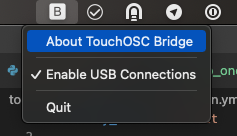
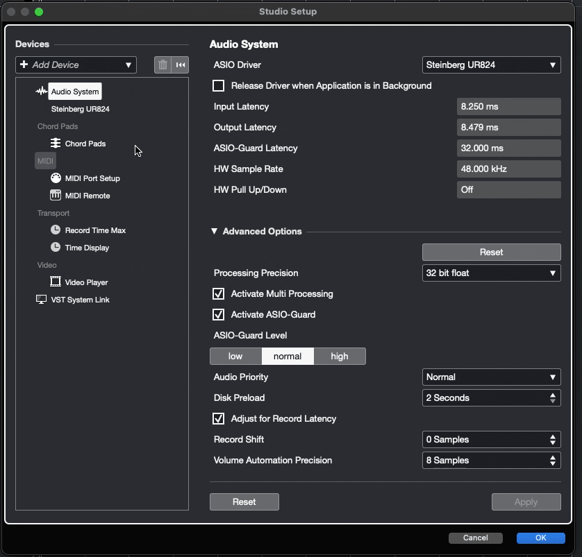
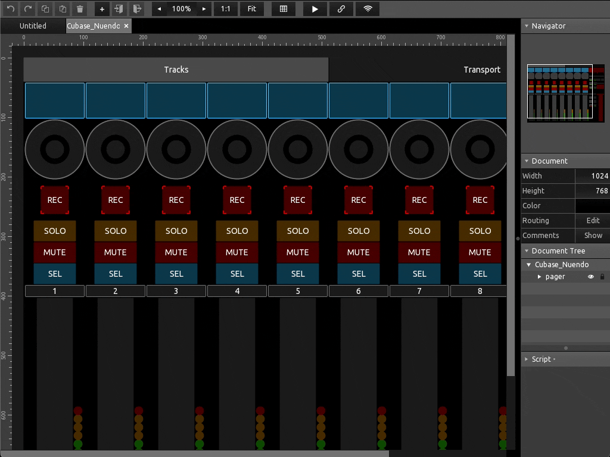

# TouchMCU

[TouchOSC](https://hexler.net/touchosc) just released their second version with
tones of new features, including a scripting area.

This project is a python project generating a TouchOSC layout that is Mackie
Control Compatible. That means you can connect it to your DAW using [TouchOSC Bridge](https://hexler.net/touchosc#resources)
as a MIDI device and make full use of Mackie Control features from your iPad.

This is the child project from my older [OscMackieControl](https://github.com/NicoG60/OscMackieControl) which can safely
retire now TouchOSC handles most of the logic for me.

I wrote an extensive reference documentation of the [Mackie Control Protocol](./doc/mackie_control_protocol.md)

## Usage

### Network

Make sure both your Workstation and your Remote Controller are using the *same local network*.
That is either (non exhaustive):
- Both on the same Wi-Fi
- Workstation Wired and Remote on Wi-fi coming from the same broadband hub.

This wont work over the internet, LTE or whatever. It needs to be the same local
network.

### Setup the Host

On your computer, install [TouchOSB Bridge](https://hexler.net/touchosc#resources)
and launch it. It should run silently in the background and create a pair of
virtual MIDI Input/Output aptly named *TouchOSC Bridge*.

Configure your DAW to use these MIDI ports as a *Mackie Control Universal* device.
I'm a Cubase user so adapt this steps to your software of choice.

> Note the emphasis on Mackie *CONTROL*. I am not talking about HUI but Mackie *CONTROL*

### Setup the Remote

You can have a look at the [Release Section](https://github.com/NicoG60/TouchMCU/releases/latest)
and download the variant that suits your DAW.

Open it in TouchOSC.

Open the *Connection* panel.

In the *BRIDGE* section your workstation should be
automatically detected and you should be able to select it.

In the *MIDI* section, select `<Bridge>` then close this panel.

Hit Play and Enjoy!

> Note: You might need to send a Reset command from your workstation so that the
> remote can pick up the current state of your DAW. I know Cubase hase such a
> feature, it is certainly the case for your DAW as well.

> Also note that this setup is a one-off. Once it is done, it should be persistent.
> As long as you have TouchOSC Bridge running on the workstation, your DAW should
> pick it up and make it work out of the box.
