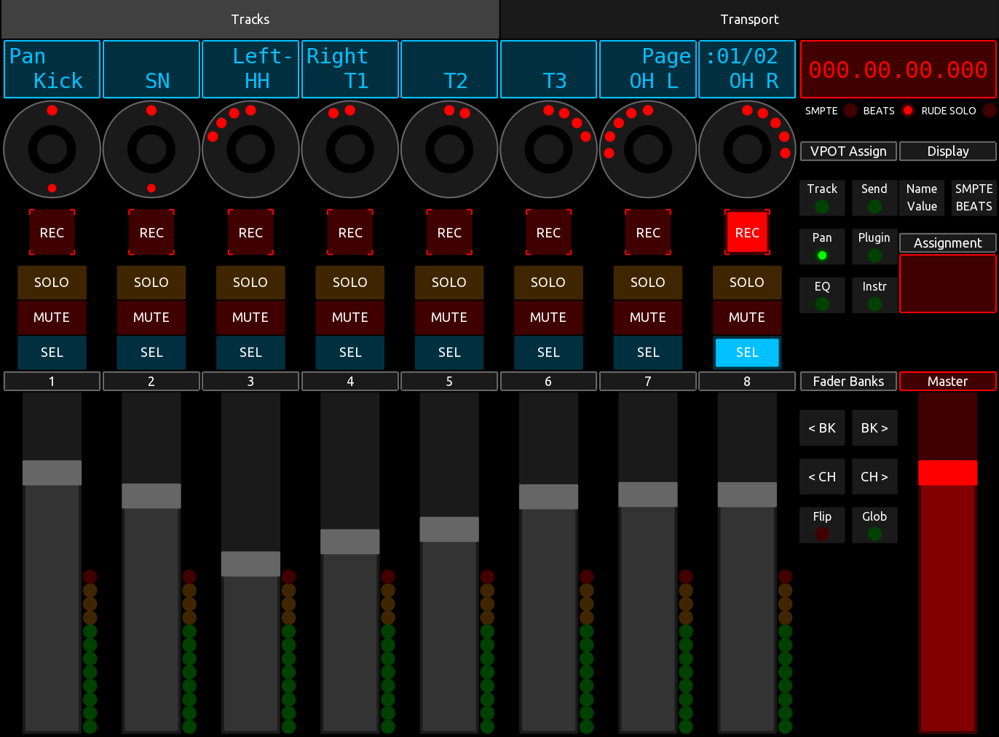

# TouchMCU

[TouchOSC](https://hexler.net/touchosc) just released their second version with
tones of new features, including a scripting area.

This project is a python project generating a TouchOSC layout that is Mackie
Control Compatible. That means you can connect it to your DAW using [TouchOSC Bridge](https://hexler.net/touchosc#resources)
as a MIDI device and make full use of Mackie Control features from your iPad.

This is the child project from my older [OscMackieControl](https://github.com/NicoG60/OscMackieControl) which can safely
retire now TouchOSC handles most of the logic for me.

I wrote an extensive reference documentation of the [Mackie Control Protocol](./doc/Mackie Control Protocol.md)

**This is still work in progress! But the release will come soon**

