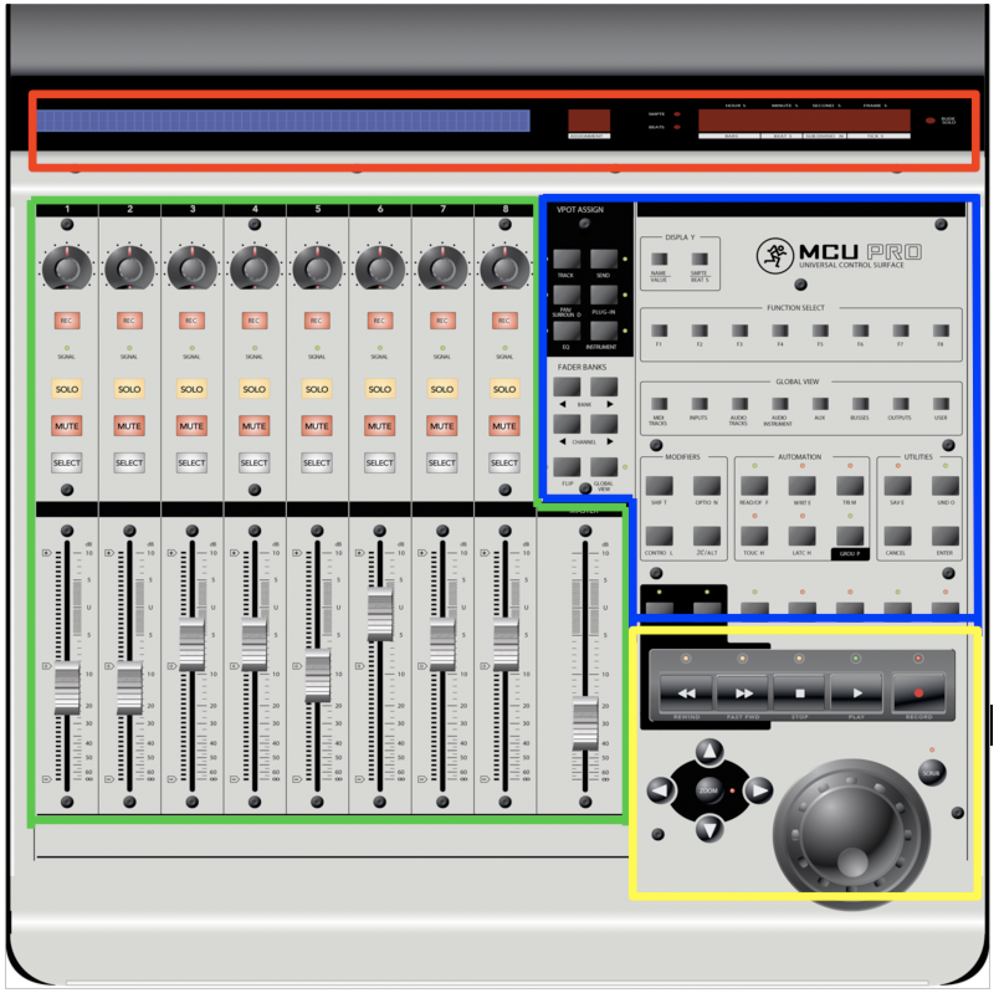
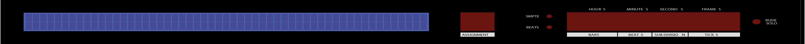
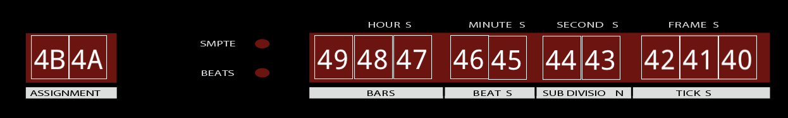
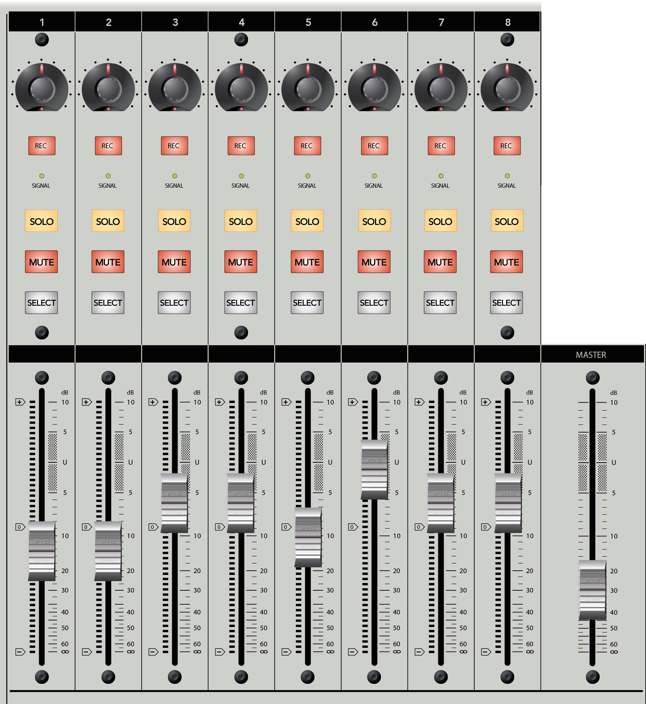
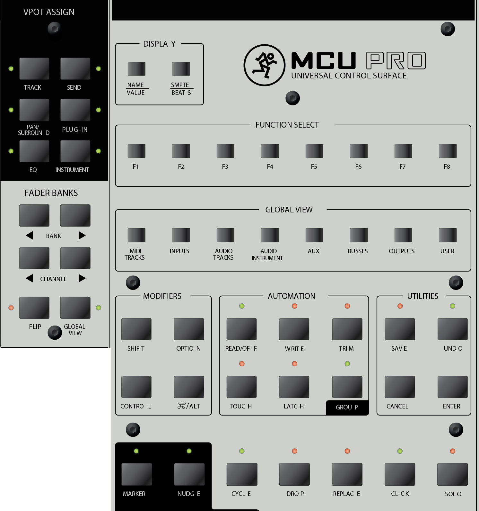
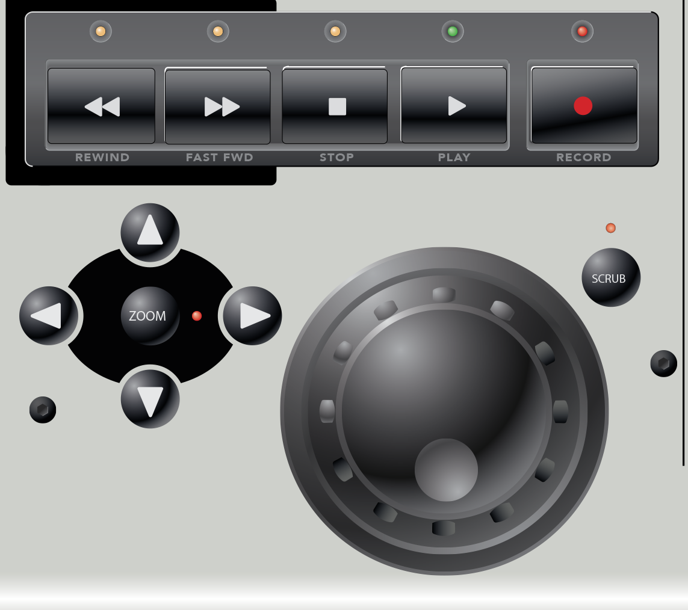

# Mackie Control Protocol

A deep dive into the DAW remote control beast.

[TOC]

## Foreword

Everyone knows it. Mackie Control is a very wide spread remote control protocol based on a clever use of not less wide spread MIDI. Unfortunately the specification is proprietary and licensed to whom wants to interface their software or controller. Furthermore, the controllers themselves are quite pricey so I decided to dig it and use my iPad as a controller. This is the results of a few months of researching and reverse engineering.

Before you start reading, please note that since it is based on MIDI, you have to know MIDI very very well to understand.

## The Controller



This is what I focused on, that controller is meant to work with the Mackie Control Protocol and features pretty much everything the protocol can do.

- In Red is the display zone
- In Green is the mixing zone
- In Blue is the function zone
- in Yellow is the transport zone

We will dig into each zone with as much details as I could find.

## General Behaviour

### Number Representation

Before we start, I would like set a couple of writing style guidance.

#### We count from 0

As this document is meant to be a reference for implementation / programming guide, 0 will be out starting point.

- Arrays and tables first index is 0.
- 16 Midi Channels from 0 to 15
- 120 Midi Notes from C-1 (0) to B8 (119)

#### Decimal, Hexadecimal and Binary

- Decimal numbers are in plain text
- Hexadecimal numbers are in monospace / code style using the `0x` prefix
- Binary numbers are in monospace / code style using the `0b` prefix

i.e. the same umber in the three representations: 127, `0x7F`, `0b01111111`

I will use upper cased letters for hexadecimal numbers and lower cased letter
when I want to denote a variable part.

i.e. the *Note Off* status message is `0b1000cccc` or `0x8c` where `c` denotes the
MIDI channel.


### Channel

Unless specified, all MIDI messages are sent on **the first midi channel (0)**.

### Buttons, LEDs and Bangs

There are more details about each buttons and each functions down this document but there is a common behaviour to all buttons and LEDs. They send what I call a MIDI *note bang*. This is a MIDI *Note On* message immediately followed by the corresponding *Note Off*. The *bang* uses the velocity of the "Note On" message as a mean of describing the button / LED state. Maximum velocity (127 / `0x7F`) is a button pressed or a LED turned on. Minimum velocity is a button released and or a LED turned off.

As a side note, this is to avoid a MIDI note overflow on the DAW. Imagine if it only used the *Note On*: a MIDI engines could try to keep track of all of them, waiting for the corresponding *Note Off*. This would build over time as we press more and more button until it runs out of memory. It's maybe not an issue anymore as MIDI engines are probably more clever than that and memory is widely available on computer now but it might have been a limitation at the time of designing this protocol. Remember, it's MIDI and we want to use existing technology with existing limitations.

In the rest of the document I will use the term *Note Bang* to describe that behaviour.

## Display Zone



### LCD Screen

The LCD screen is a 2x56 characters LCD, 112 characters in total. It is controlled by *System Exclusive* messages from the DAW.

The content of the message is the following (in *hexadecimal*, omitting the `0x` prefix for readability):

```
F0 00 00 66 14 12 pp cc cc .. cc F7
```

- `0xF0` at the start, `0xF7` at the end: These are the MIDI *System Exclusive* message boundaries. `0xF0` being the MIDI *status* of *SystemExclusive*
- `0x00` `0x00` `0x66` is the Manufacturer ID (Mackie in that case)
- `0x14` is the Product ID (Mackie Control Universal Pro)
- `0x12` is the LCD identifier any other values would refer to other components (as I understand it).
- `0xpp` is the location of the first character sent. This value range between `0x00` and `0x6F` (0 to 111 in decimal). 
- `0xcc 0xcc .. 0xcc` is a list of characters. the first one replace the character position `0xpp`, the second one replacing `0xpp+1` etc...

Character codes are basic ASCII character. There is room for a character set extension here with some special symbols being used but I've not been able to reference them yet.

### SMPTE, BEATS, Rude Solo

Those three LEDs are controlled by *Note Bangs* sent by the DAW.

| LED       | Note | Decimal | Hex    |
| --------- | ---- | ------- | ------ |
| SMPTE     | F8   | 113     | `0x71` |
| BEATS     | F#8  | 114     | `0x72` |
| Rude Solo | G8   | 115     | `0x73` |

### Assignment & Timecode Display

It is composed of 12 7-segments displays. They are controlled by *Control Change* message sent by the DAW. **Some DAWs use Channel 15 (the last one), others use Channel 0 (the first one).** From right to left, *CC* number 64 (`0x40`) to 75 (`0x4B`) as such:



The *Value* field of the CC message control what to display:

```
|    |dot |            ASCII            |
| b7 | b6 | b5 | b4 | b3 | b2 | b1 | b0 |
```

- Bit 7 is always 0 as per the MIDI standard
- Bit 6 is the *Dot* on/off toggle. (each 7-seg display has a dot)
- Bit 5-0 is the character to display. It supports the characters from 48 (`0x30`) to 95 (`0x5F`). Which is the range where alphanumeric characters are located in a standard ASCII table.

As Bit 6 is used for the *Dot* of the 7-segment display, characters from 64 (`0x40`) to 95 (`0x5F`) are apparently out of range but in fact, the 6th bit is simply ignored. Characters with ASCII code >= 64 (`0x40`) are stripped from there 6th bit ( or subtracted 64 ) and sent over.

A summary table of available characters is available [in appendix](#special-ascii-table-for-assignment-&-timecode-display)


## Mixing zone



This where the cool stuff happens and this is probably what you are here for.

### Virtual Pot

Each track has a virtual pot. They are composed of:

- A clickable rotary encoder
- 11 surrounding LEDs, called ring
- 1 small LED underneath the encoder

#### Rotating vPots

The MCU sends *Control Change* messages to notify the DAW about an encoder being rotated. From *CC* number 16 (`0x10`) for the first channel strip to 23 (`0x17`) for the eighth channel strip.

The direction of rotation is represented using the *Value* field of the message as such:

- `0b00000001` means rotating clockwise
- `0b01000001` means rotating counter-clockwise

This looks very much like a 6bit integer and the 7th bit being a sign bit, this would translate to +1 for clockwise and -1 for counter-clockwise. There is a good chance that using greater values than +1 and -1 encodes the speed of rotation but I was unable to test it.

#### Clicking vPots

Using a *Note Bang* ranging from G#1 (32, `0x20`) for the first channel strip to D#2 (39, `0x27`) for the eighth channel strip.

#### vPots LED Ring

the DAW sends *Control Change* messages to control the LED ring. From *CC* number 48 (`0x30`) for the first channel strip to 55 (`0x37`) for the eighth channel strip.

Again, the *Value* field is divided in a 4-bits control/value pair:

```
|    |led |  mode   |  Value            |
| b7 | b6 | b5 | b4 | b3 | b2 | b1 | b0 |
```


- Bit 7 is always 0
- Bit 6 is the on/off toggle of the little LED underneath the encoder.
- Bits 5 and 4 represent a *Mode* value
- Bits 3 to 0 represent the *Value*

The following table shows the correspondance between *Mode*, *Value* and the LED ring state.

|        | Mode `0b00`   | Mode `0b01`   | Mode `0b10`   | Mode `0b11`   |
| ------ | ------------- | ------------- | ------------- | ------------- |
| `0x00` | `-----------` | `-----------` | `-----------` | `-----------` |
| `0x01` | `O----------` | `OOOOOO-----` | `O----------` | `-----O-----` |
| `0x02` | `-O---------` | `-OOOOO-----` | `OO---------` | `----OOO----` |
| `0x03` | `--O--------` | `--OOOO-----` | `OOO--------` | `---OOOOO---` |
| `0x04` | `---O-------` | `---OOO-----` | `OOOO-------` | `--OOOOOOO--` |
| `0x05` | `----O------` | `----OO-----` | `OOOOO------` | `-OOOOOOOOO-` |
| `0x06` | `-----O-----` | `-----O-----` | `OOOOOO-----` | `OOOOOOOOOO`  |
| `0x07` | `------O----` | `-----OO----` | `OOOOOOO----` | `OOOOOOOOOO`  |
| `0x08` | `-------O---` | `-----OOO---` | `OOOOOOOO---` | `OOOOOOOOOO`  |
| `0x09` | `--------O--` | `-----OOOO--` | `OOOOOOOOO--` | `OOOOOOOOOO`  |
| `0x0A` | `---------O-` | `-----OOOOO-` | `OOOOOOOOOO-` | `OOOOOOOOOO`  |
| `0x0B` | `----------O` | `-----OOOOOO` | `OOOOOOOOOOO` | `OOOOOOOOOO`  |

### Rec, Solo, Mute, Select

All those buttons follow the *Note Bang* behaviour. Here is a summary of what note they are bound to

| Button | 1st channel           | 8th channel           |
| ------ | --------------------- | --------------------- |
| REC    | C-1  (0, `0x00`)      | G-1 (7, `0x07`)       |
| SOLO   | G#-1 (8, `0x08`)      | D#0 (8, `0x0F`)       |
| MUTE   | E0   (16, `0x10`)     | B0  (16, `0x17`)      |
| SEL    | C1   (24, `0x18`)     | G1  (24, `0x1F`)      |

### VU Meter

This one is not shown on the illustration but exists in the standard. You can have one VU Meter per channel. They are composed of 12 LEDs red to green. They are controller by the DAW using *Channel Pressure* MIDI message.

Again the *Value* field of the *Channel Pressure* message is divided in a pair a 4-bits data. The most significant 4 bits represents the channel strip ID from 0 to 7. The least significant 4 bits represents the state of the vu meter as such:

| Value  | Signal    | Leds         |
| ------ | --------- | ------------ |
| `0x0C` | \>= 0dB   | Red (clip)   |
| `0x0B` | \>= -2dB  | Yellow       |
| `0x0A` | \>= -4dB  | Yellow       |
| `0x09` | \>= -6dB  | Yellow       |
| `0x08` | \>= -8dB  | Green        |
| `0x07` | \>= -10dB | Green        |
| `0x06` | \>= -14dB | Green        |
| `0x05` | \>= -20dB | Green        |
| `0x04` | \>= -30dB | Green        |
| `0x03` | \>= -40dB | Green        |
| `0x02` | \>= -50dB | Green        |
| `0x01` | \>= -60dB | Green        |
| `0x00` | < -60dB   | All LEDs Off |

### Fader

Faders uses the greater resolution of *Pitch Bend* messages for position and *Note Bangs* for fader touch notification.

Fader touch behaves exactly as buttons. when the fader is touched the "button" is pressed. Notes range from G#7 (104, `0x68`) for the first fader to E8 (112, `0x70`) for the Master fader (9th fader)

For the position, it uses the full 14 bits of the *Pitch Bend Value* component. 0 being all the way down, and 16383 being top of the roof.

**MIDI Channel 0 to 8 are used to drive the 9 faders**

Either if the controller wants to move the faders on the DAW or the DAW wants to move the controller faders, the sequence of messages is the same:

- Fader touched
- Fader new position
- Fader new position
- etc...
- Fader released

## Function zone



This part is full of buttons and LEDs that follows the *Note Bang* behaviour. There is a massive summary table down there where all individual buttons are detailed.

## Transport zone



### Transport Buttons

They all follow the *Note Bang* behaviour and are detailed in the massive table down there.

### Scroll encoder

This works exactly as the vPot encoders works. It uses *CC* number 60.

- +1: clockwise
- -1: coutner-clockwise

# Massive MIDI Note Mapping Summary

All note mapping is on Channel 0 (the first one).

|     Button / Led     | Note | Dec  | Hex  |
| :------------------: | :--: | :--: | :--: |
|        Rec 1         | C-1  |  0   |  0   |
|        Rec 2         | C#-1 |  1   |  1   |
|        Rec 3         | D-1  |  2   |  2   |
|        Rec 4         | D#-1 |  3   |  3   |
|        Rec 5         | E-1  |  4   |  4   |
|        Rec 6         | F-1  |  5   |  5   |
|        Rec 7         | F#-1 |  6   |  6   |
|        Rec 8         | G-1  |  7   |  7   |
|                      |      |      |      |
|        Solo 1        | G#-1 |  8   |  8   |
|        Solo 2        | A-1  |  9   |  9   |
|        Solo 3        | A#-1 |  10  |  A   |
|        Solo 4        | B-1  |  11  |  B   |
|        Solo 5        |  C0  |  12  |  C   |
|        Solo 6        | C#0  |  13  |  D   |
|        Solo 7        |  D0  |  14  |  E   |
|        Solo 8        | D#0  |  15  |  F   |
|                      |      |      |      |
|        Mute 1        |  E0  |  16  |  10  |
|        Mute 2        |  F0  |  17  |  11  |
|        Mute 3        | F#0  |  18  |  12  |
|        Mute 4        |  G0  |  19  |  13  |
|        Mute 5        | G#0  |  20  |  14  |
|        Mute 6        |  A0  |  21  |  15  |
|        Mute 7        | A#0  |  22  |  16  |
|        Mute 8        |  B0  |  23  |  17  |
|                      |      |      |      |
|        Sel 1         |  C1  |  24  |  18  |
|        Sel 2         | C#1  |  25  |  19  |
|        Sel 3         |  D1  |  26  |  1A  |
|        Sel 4         | D#1  |  27  |  1B  |
|        Sel 5         |  E1  |  28  |  1C  |
|        Sel 6         |  F1  |  29  |  1D  |
|        Sel 7         | F#1  |  30  |  1E  |
|        Sel 8         |  G1  |  31  |  1F  |
|                      |      |      |      |
|    Vpot switch 1     | G#1  |  32  |  20  |
|    Vpot switch 2     |  A1  |  33  |  21  |
|    Vpot switch 3     | A#1  |  34  |  22  |
|    Vpot switch 4     |  B1  |  35  |  23  |
|    Vpot switch 5     |  C2  |  36  |  24  |
|    Vpot switch 6     | C#2  |  37  |  25  |
|    Vpot switch 7     |  D2  |  38  |  26  |
|    Vpot switch 8     | D#2  |  39  |  27  |
|                      |      |      |      |
|     Assign Track     |  E2  |  40  |  28  |
|     Assign Send      |  F2  |  41  |  29  |
| Assign Pan/Surround  | F#2  |  42  |  2A  |
|    Assign Plug-in    |  G2  |  43  |  2B  |
|      Assign EQ       | G#2  |  44  |  2C  |
|  Assign Instrument   |  A2  |  45  |  2D  |
|                      |      |      |      |
|      Bank Left       | A#2  |  46  |  2E  |
|      Bank Right      |  B2  |  47  |  2F  |
|     Channel Left     |  C3  |  48  |  30  |
|    Channel Right     | C#3  |  49  |  31  |
|         Flip         |  D3  |  50  |  32  |
|        Global        | D#3  |  51  |  33  |
|                      |      |      |      |
| Name / Value Button  |  E3  |  52  |  34  |
| SMPTE / BEATS Button |  F3  |  53  |  35  |
|                      |      |      |      |
|          F1          | F#3  |  54  |  36  |
|          F2          |  G3  |  55  |  37  |
|          F3          | G#3  |  56  |  38  |
|          F4          |  A3  |  57  |  39  |
|          F5          | A#3  |  58  |  3A  |
|          F6          |  B3  |  59  |  3B  |
|          F7          |  C4  |  60  |  3C  |
|          F8          | C#4  |  61  |  3D  |
|                      |      |      |      |
|     MIDI Tracks      |  D4  |  62  |  3E  |
|        Inputs        | D#4  |  63  |  3F  |
|     Audio Tracks     |  E4  |  64  |  40  |
|   Audio Intruments   |  F4  |  65  |  41  |
|         Aux          | F#4  |  66  |  42  |
|        Busses        |  G4  |  67  |  43  |
|       Outputs        | G#4  |  68  |  44  |
|         User         |  A4  |  69  |  45  |
|                      |      |      |      |
|        Shift         | A#4  |  70  |  46  |
|        Option        |  B4  |  71  |  47  |
|       Control        |  C5  |  72  |  48  |
|         Alt          | C#5  |  73  |  49  |
|                      |      |      |      |
|       Read/Off       |  D5  |  74  |  4A  |
|        Write         | D#5  |  75  |  4B  |
|         Trim         |  E5  |  76  |  4C  |
|        Touch         |  F5  |  77  |  4D  |
|        Latch         | F#5  |  78  |  4E  |
|        Group         |  G5  |  79  |  4F  |
|                      |      |      |      |
|         Save         | G#5  |  80  |  50  |
|         Undo         |  A5  |  81  |  51  |
|        Cancel        | A#5  |  82  |  52  |
|        Enter         |  B5  |  83  |  53  |
|                      |      |      |      |
|       Markers        |  C6  |  84  |  54  |
|        Nudge         | C#6  |  85  |  55  |
|        Cycle         |  D6  |  86  |  56  |
|         Drop         | D#6  |  87  |  57  |
|       Replace        |  E6  |  88  |  58  |
|        Click         |  F6  |  89  |  59  |
|         Solo         | F#6  |  90  |  5A  |
|                      |      |      |      |
|        Rewind        |  G6  |  91  |  5B  |
|       Forward        | G#6  |  92  |  5C  |
|         Stop         |  A6  |  93  |  5D  |
|         Play         | A#6  |  94  |  5E  |
|        Record        |  B6  |  95  |  5F  |
|                      |      |      |      |
|          Up          |  C7  |  96  |  60  |
|         Down         | C#7  |  97  |  61  |
|        Scrub         |  D7  |  98  |  62  |
|         Zoom         | D#7  |  99  |  63  |
|         Left         |  E7  | 100  |  64  |
|        Right         |  F7  | 101  |  65  |
|                      |      |      |      |
|                      | F#7  | 102  |  66  |
|                      |  G7  | 103  |  67  |
|                      |      |      |      |
|   Fader 1 Touched    | G#7  | 104  |  68  |
|   Fader 2 Touched    |  A7  | 105  |  69  |
|   Fader 3 Touched    | A#7  | 106  |  6A  |
|   Fader 4 Touched    |  B7  | 107  |  6B  |
|   Fader 5 Touched    |  C8  | 108  |  6C  |
|   Fader 6 Touched    | C#8  | 109  |  6D  |
|   Fader 7 Touched    |  D8  | 110  |  6E  |
|   Fader 8 Touched    | D#8  | 111  |  6F  |
| Master Fader Touched |  E8  | 112  |  70  |
|                      |      |      |      |
|      SMPTE Led       |  F8  | 113  |  71  |
|      BEATS Led       | F#8  | 114  |  72  |
|    RUDE SOLO Led     |  G8  | 115  |  73  |
|                      |      |      |      |
|                      | G#8  | 116  |  74  |
|                      |  A8  | 117  |  75  |
|     Relay Click      | A#8  | 118  |  76  |
|                      |  B8  | 119  |  77  |

# Control Change Mapping Summary

| Control                      | MIDI Channel | CC # | Hex  |
| ---------------------------- | ------------ | ---- | ---- |
| vPot 1 rotation              | 0            | 16   | 10   |
| vPot 2 rotation              | 0            | 17   | 11   |
| vPot 3 rotation              | 0            | 18   | 12   |
| vPot 4 rotation              | 0            | 19   | 13   |
| vPot 5 rotation              | 0            | 20   | 14   |
| vPot 6 rotation              | 0            | 21   | 18   |
| vPot 7 rotation              | 0            | 22   | 16   |
| vPot 8 rotation              | 0            | 23   | 17   |
|                              |              |      |      |
| vPot 1 LED ring              | 0            | 48   | 30   |
| vPot 2 LED ring              | 0            | 49   | 31   |
| vPot 3 LED ring              | 0            | 50   | 32   |
| vPot 4 LED ring              | 0            | 51   | 33   |
| vPot 5 LED ring              | 0            | 52   | 34   |
| vPot 6 LED ring              | 0            | 53   | 35   |
| vPot 7 LED ring              | 0            | 54   | 36   |
| vPot 8 LED ring              | 0            | 55   | 37   |
|                              |              |      |      |
| Jog wheel                    | 0            | 60   | 3C   |
|                              |              |      |      |
| Timecode digit 1             | 0 or 15      | 64   | 40   |
| Timecode digit 2             | 0 or 15      | 65   | 41   |
| Timecode digit 3             | 0 or 15      | 66   | 42   |
| Timecode digit 4             | 0 or 15      | 67   | 43   |
| Timecode digit 5             | 0 or 15      | 68   | 44   |
| Timecode digit 6             | 0 or 15      | 69   | 45   |
| Timecode digit 7             | 0 or 15      | 70   | 46   |
| Timecode digit 8             | 0 or 15      | 71   | 47   |
| Timecode digit 9             | 0 or 15      | 72   | 48   |
| Timecode digit 10            | 0 or 15      | 73   | 49   |
|                              |              |      |      |
| Assignment digit 1           | 0 or 15      | 74   | 4A   |
| Assignment digit 2           | 0 or 15      | 75   | 4B   |

# Pitch Bend Mapping Summary

| Control               | MIDI Channel |
| --------------------- | ------------ |
| Fader 1 position      | 0            |
| Fader 2 position      | 1            |
| Fader 3 position      | 2            |
| Fader 4 position      | 3            |
| Fader 5 position      | 4            |
| Fader 6 position      | 5            |
| Fader 7 position      | 6            |
| Fader 8 position      | 7            |
| Master Fader position | 8            |

# Channel Pressure (After Touch) Mapping Summary

| Control  | MIDI Channel |
| -------- | ------------ |
| Vu Meter | 0            |

# Special ASCII Table for Assignment & Timecode Display

| Mackie Control Code (Bit 5-0) | Equivalent ASCII code | Character |
| ----------------------------- | --------------------- | --------- |
| 0 (`0x00`)                    | 64 (`0x40`)           |           |
| 1 (`0x01`)                    | 65 (`0x41`)           | A         |
| 2 (`0x02`)                    | 66 (`0x42`)           | B         |
| 3 (`0x03`)                    | 67 (`0x43`)           | C         |
| 4 (`0x04`)                    | 68 (`0x44`)           | D         |
| 5 (`0x05`)                    | 69 (`0x45`)           | E         |
| 6 (`0x06`)                    | 70 (`0x46`)           | F         |
| 7 (`0x07`)                    | 71 (`0x47`)           | G         |
| 8 (`0x08`)                    | 72 (`0x48`)           | H         |
| 9 (`0x09`)                    | 73 (`0x49`)           | I         |
| 10 (`0x0A`)                   | 74 (`0x4A`)           | J         |
| 11 (`0x0B`)                   | 75 (`0x4B`)           | K         |
| 12 (`0x0C`)                   | 76 (`0x4C`)           | L         |
| 13 (`0x0D`)                   | 77 (`0x4D`)           | M         |
| 14 (`0x0E`)                   | 78 (`0x4E`)           | N         |
| 15 (`0x0F`)                   | 79 (`0x4F`)           | O         |
| 16 (`0x10`)                   | 80 (`0x50`)           | P         |
| 17 (`0x11`)                   | 81 (`0x51`)           | Q         |
| 18 (`0x12`)                   | 82 (`0x52`)           | R         |
| 19 (`0x13`)                   | 83 (`0x53`)           | S         |
| 20 (`0x14`)                   | 84 (`0x54`)           | T         |
| 21 (`0x15`)                   | 85 (`0x55`)           | U         |
| 22 (`0x16`)                   | 86 (`0x56`)           | V         |
| 23 (`0x17`)                   | 87 (`0x57`)           | W         |
| 24 (`0x18`)                   | 88 (`0x58`)           | X         |
| 25 (`0x19`)                   | 89 (`0x59`)           | Y         |
| 26 (`0x1A`)                   | 90 (`0x5A`)           | Z         |
| 27 (`0x1B`)                   | 91 (`0x5B`)           |           |
| 28 (`0x1C`)                   | 92 (`0x5C`)           |           |
| 29 (`0x1D`)                   | 93 (`0x5D`)           |           |
| 30 (`0x1E`)                   | 94 (`0x5E`)           |           |
| 31 (`0x1F`)                   | 95 (`0x5F`)           |           |
|                               |                       |           |
| 32 (`0x20`)                   | 32 (`0x20`)           | *(Space)* |
| 33 (`0x21`)                   | 33 (`0x21`)           |           |
| 34 (`0x22`)                   | 34 (`0x22`)           |           |
| 35 (`0x23`)                   | 35 (`0x23`)           |           |
| 36 (`0x24`)                   | 36 (`0x24`)           |           |
| 37 (`0x25`)                   | 37 (`0x25`)           |           |
| 38 (`0x26`)                   | 38 (`0x26`)           |           |
| 39 (`0x27`)                   | 39 (`0x27`)           |           |
| 40 (`0x28`)                   | 40 (`0x28`)           |           |
| 41 (`0x29`)                   | 41 (`0x29`)           |           |
| 42 (`0x2A`)                   | 42 (`0x2A`)           |           |
| 43 (`0x2B`)                   | 43 (`0x2B`)           |           |
| 44 (`0x2C`)                   | 44 (`0x2C`)           |           |
| 45 (`0x2D`)                   | 45 (`0x2D`)           |           |
| 46 (`0x2E`)                   | 46 (`0x2E`)           |           |
| 47 (`0x2F`)                   | 47 (`0x2F`)           |           |
| 48 (`0x30`)                   | 48 (`0x30`)           | 0         |
| 49 (`0x31`)                   | 49 (`0x31`)           | 1         |
| 50 (`0x32`)                   | 50 (`0x32`)           | 2         |
| 51 (`0x33`)                   | 51 (`0x33`)           | 3         |
| 52 (`0x34`)                   | 52 (`0x34`)           | 4         |
| 53 (`0x35`)                   | 53 (`0x35`)           | 5         |
| 54 (`0x36`)                   | 54 (`0x36`)           | 6         |
| 55 (`0x37`)                   | 55 (`0x37`)           | 7         |
| 56 (`0x38`)                   | 56 (`0x38`)           | 8         |
| 58 (`0x3A`)                   | 58 (`0x3A`)           |           |
| 59 (`0x3B`)                   | 59 (`0x3B`)           |           |
| 60 (`0x3C`)                   | 60 (`0x3C`)           |           |
| 61 (`0x3D`)                   | 61 (`0x3D`)           |           |
| 62 (`0x3E`)                   | 62 (`0x3E`)           |           |
| 63 (`0x3F`)                   | 63 (`0x3F`)           |           |

# Reminder of MIDI Messages Format

| Message                       | Status Byte<br />D7..D0 | Data1 Byte<br />D7..D0 | Data2 Byte<br />D7..D0 |                                                  |
| ----------------------------- | ----------------------- | ---------------------- | ---------------------- | ------------------------------------------------ |
| Note Off                      | `0b1000cccc`            | `0b0nnnnnnn`           | `0b0vvvvvvv`           | `c`: Channel<br />`n`: Note<br />`v`: Velocity   |
| Note On                       | `0b1001cccc`            | `0b0nnnnnnn`           | `0b0vvvvvvv`           | `c`: Channel<br />`n`: Note<br />`v`: Velocity   |
| AfterTouch<br />Key pressure  | `0b1010cccc`            | `0b0nnnnnnn`           | `0b0vvvvvvv`           | `c`: Channel<br />`n`: Note<br />`v`: Velocity   |
| Control Change                | `0b1011cccc`            | `0b0nnnnnnn`           | `0b0vvvvvvv`           | `c`: Channel<br />`n`: CC number<br />`v`: Value |
| Program Change                | `0b1100cccc`            | `0b0ppppppp`           |                        | `c`: Channel<br />`p`: Program                   |
| AfterTouch<br />Chan Pressure | `0b1101cccc`            | `0b0vvvvvvv`           |                        | `c`: Channel<br />`v`: Value                     |
| Pitch Bend                    | `0b1110cccc`            | `0b0lllllll`           | `0b0mmmmmmm`           | `c`: Channel<br />`l`: LSB<br />`m`: MSB         |
| Sysex start                   | `0b11110000`            |                        |                        |                                                  |
| Sysex end                     | `0b11110111`            |                        |                        |                                                  |
