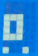
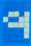

# Mackie Control Protocol

A deep dive into the DAW remote control beast.

    TODO: [TOC]

## Foreword

Everyone knows it. The Mackie Control is a very widespread remote control protocol
based on a clever use of the not less widespread MIDI standard. Unfortunately the specification is proprietary and
licensed to whom wants to interface their software or controller. Furthermore,
the controllers themselves are quite pricey, so I decided to dig it and use my iPad as a controller.
This is the results of a few months of research and reverse engineering.

Further independent research and reverse engineering has been made by Raphaël Doursenaud (@rdoursenaud) using original
hardware
(A Mackie Control Universal Pro running the v3.0.0 firmware and a BabyHUI) together with its own
[MIDI Explorer](https://github.com/ematech/midiexplorer) tool to validate findings and complete some
missing and/or grey areas.

Before you start reading, please note that since the protocol is MIDI (v1) based,
you have to know MIDI very, very well to understand most of it.
Check out the now free standard at https://midi.org if you're unfamiliar.

## History

A brief history of the device helps understand what shaped its design and the associated protocol(s).

### Mackie HUI

**1997**

- Protocol: HUI (Human User Interface)
- Interface: MIDI on 5-Pin DINs or a serial RS232/422 port.
- Specs:
    - 8 channel strips with dedicated:
        - Stereo LED meter
        - Rotary encoder with LED ring
        - REC RDY/INSERT/V-SEL/AUTO/SOLO/MUTE/SELECT button
        - 4 character LED dot matrix display (Resolution?)
        - 100mm touch-sensitive fader
    - 40 × 2 VFD with:
        - 4 rotary encoders with LED ring + 1 without
    - Time Code/BBT 7-segment display
    - Numeric keypad
    - Select assign 4 character LED dot-matrix display (Resolution?)
    - Plethora of function buttons
    - Transport section
        - Jog Wheel
        - Navigation buttons
    - 2 relays
    - Integrated analog circuits:
        - 2 + 1 talkback MIC preamplifiers
        - 3 stereo channels monitoring controller
        - talkback management with embedded MIC
    - Power: 60 W
    - Dimensions:
        - Width: 572 mm (22.5")
        - Depth: 523 mm (20.6")
        - Height: 165 mm (6.5")
    - Weight: 16.8 Kg

The first "affordable" widely adopted motorized touch-sensitive control surface.
Made in cooperation with and specifically for Digidesign's (Now Avid) popular DAW: Pro Tools.

Later declined into the cost-reduced and feature-cut BabyHUI (2002) and the large & mighty D8B.

The popularity of the device means that a lot of other software progressively decided to implement its protocol
including popular DAWs and Video Editing packages.
It was deemed the Universal DAW controller for a time.
Which makes it still relevant today despite its flaws.

https://en.wikipedia.org/wiki/Human_User_Interface_Protocol  
https://www.soundonsound.com/reviews/mackie-hui

### Emagic Logic Control

**2002**

- Protocol: LCU (Logic Control Unit)
- Interface: MIDI on 5-Pin DINs
- Specs:
- 55 characters × 2 lines backlit LCD (Characters: 5 × 8 dot-matrix)
- 2-digit 7-segment mode display
- 10-digit 7-segment timecode display
- 8 channel strips with dedicated:
    - Rotary encoder with LED ring (V-POT)
    - Signal present LED
    - REC/SOLO/MUTE/SELECT buttons with LED
    - 100mm touch-sensitive Penny & Gilles fader with 10-bit resolution
- Plethora of function buttons and LEDs
- Transport section with jog wheel
- External assignable:
    - 2 × foot switch
    - 1 × control pedal
- Dimensions:
    - Width: 441 mm
    - Depth: 444 mm
    - Height: 96 mm
- Weight: 5.05 Kg

Emagic decided to partner with Mackie to design a controller tailored for their up-and-coming DAW:
Logic (Now known as Apple Logic Pro).
This led to the release of the Logic Control which premiered the design and most of the features the modern
Mackie Control sports to this day.
The layout is clearly inspired from the HUI with the addition of a dedicated Master fader,
removal of all the analog electronics functions and computer specific ports and simplification of the displays.
The protocol, while clearly inspired by the HUI, departs a lot from it and has been largely optimized to reduce the
bandwidth usage which plagued the HUI.
The documentation is complete and awesome.

https://fr.audiofanzine.com/surface-de-controle-motorisee/emagic/Logic-Control/news/a.play,n.271.html  
https://www.soundonsound.com/reviews/emagic-logic-v5-logic-control

#### XT

8 faders extension

### MOTU Control?

Elusive controller made by Mackie exclusively for MOTU's DAW: Digital Performer.

### Mackie Control

- Protocol: MCU (Mackie Control Unit)
- Interface: MIDI on 5-Pin DINs (and/or USB-MIDI compliant on the [Pro](#pro) variant)

Same hardware different protocol.
Seems to be what prompted Emagic to release the protocol documentation.

**2002/07**

v1.x

https://fr.audiofanzine.com/surface-de-controle-motorisee/mackie/Control/news/a.play,n.559.html

v2.x: introduced HUI backwards compatibility

https://www.soundonsound.com/reviews/mackie-control-universal

**2003**

v3.x

A $99 firmware update for the Logic Control and Mackie Control that unified the product line and brought 3 modes:

- Mackie Control
- Logic Control
- HUI

https://fr.audiofanzine.com/surface-de-controle-motorisee/mackie/Control/news/a.play,n.1003.html

### C4

Announced 2003 and finally released in 2006?

- 4 displays
- 32 rotary encoders
- Software controlled assignations (C4 Commander)

Ultimately a market failure?

https://www.soundonsound.com/reviews/mackie-c4

#### Universal

**2003/09**

Mackie later revised the design of its product to reflect the compatibility changes and added Universal to the branding.
https://fr.audiofanzine.com/surface-de-controle-motorisee/mackie/control-universal/news/a.play,n.1074.html

#### Pro

**2007**

A facelift redesign with modernized components.
Adds USB connectivity to the main unit with an integrated 3 ports MIDI interface for extensions.
https://fr.audiofanzine.com/surface-de-controle-motorisee/mackie/Control-Universal-Pro/news/a.play,n.4187.html

**2010**

v4.0.0

Changed the faders from Penny and Giles (P+G) optical encoders to ALPS resistive.

https://fr.audiofanzine.com/surface-de-controle-motorisee/mackie/Control-Universal-Pro/news/a.play,n.13325.html

## The Controller


This is what I focused on, that controller is meant to work with the Mackie Control Protocol and
features pretty much everything the protocol can do.

- In <span style="color:red">Red</span> is the display zone
- In <span style="color:green">Green</span> is the mixing zone
- In <span style="color:blue">Blue</span> is the function zone
- in <span style="color:yellow">Yellow</span> is the transport zone

We will dig into each zone with as many details as I could find.

## General Behaviour

### Number Representation

Before we start, I would like set a couple of writing style guidance.

#### We count from 0

As this document is meant to be a reference for implementation / programming guide, 0 will be out starting point.

- Arrays and tables first index is 0.
- 16 Midi Channels from 0 to 15
- 120 Midi Notes from C-1 (0) to B8 (119)

#### Decimal, Hexadecimal and Binary

- Decimal numbers are in plain text
- Hexadecimal numbers are in monospace / code style using the `0x` prefix
- Binary numbers are in monospace / code style using the `0b` prefix

i.e. the same number in the three representations: 127, `0x7F`, `0b01111111`

I will use upper-cased letters for hexadecimal numbers and lower cased letter
when I want to denote a variable part.

i.e. the *Note Off* status message is `0b1000cccc` or `0x8c` where `c` denotes the
MIDI channel.

### Channel

Unless specified, all MIDI messages are sent on **the first midi channel (0)**.

### System Exclusive messages format (SysEx)

While most features are controlled using standard MIDI messages,
some advanced features require the use of System Exclusive messages.
System Exclusive messages are a standard facility provided by MIDI to
allow manufacturers to extend the protocol.

While the MIDI specification requires vendors to publish their implementation
for interoperability purposes, some, unfortunately, choose not to.
Mackie chose the latter.

Fortunately, Emagic has extensive documentation of its Logic Control protocol
which is a precursor to the MCU (See [History](#history)).
This is how we obtained the following messages and
verified these are working appropriately in MCU mode.

The content of the message is the following
(in *hexadecimal*, omitting the `0x` prefix for readability):

```
F0 <Hdr> <Cmd> [<Prm>] F7
```

- `0xF0` at the start. Standard MIDI *Start of System Exclusive* (SOX) *status byte*.
- `<Hdr>`: Standard MIDI [Header](#header)
- `<Cmd>`: Proprietary [Command](#commands--parameters)
- `<Prm>`: Proprietary [Optional Parameters](#commands--parameters)
- `0xF7` at the end. Standard MIDI *End of System Exclusive* (EOX) *status byte*.
  Together with SOX, these constitute MIDI *System Exclusive* message boundaries.

#### Header

Standard MIDI SysEx.

```
00 00 66 dd
```

- `0x00` `0x00` `0x66`: 3-byte Manufacturer ID for Mackie Designs.
- `dd` : Device ID. `0x14` in most cases (Mackie Control).

Reference list of known Mackie Designs device IDs:

| ID     | Device                               |
|--------|--------------------------------------|
| `0x05` | Mackie HUI (also BabyHUI and D8B)    |
| `0x10` | Emagic Logic Control                 |
| `0x11` | Emagic Logic Control XT              |
| `0x14` | **Mackie Control (Universal) (Pro)** |
| `0x15` | Mackie Control (Universal) XT (Pro)  |
| ?      | Mackie Control (Universal) (Pro) C4  |
| `0x7F` | /!\ Firmware update mode /!\ Omni?   |

#### Commands & Parameters

Mostly extracted from the Logic Control documentation which is a precursor to the MCU.

| Code                     | Parameters                         | Parm. len. (bytes)    | Direction (Device PoV)                                                           | Command                              | Test status                                                                                    |
|--------------------------|------------------------------------|-----------------------|----------------------------------------------------------------------------------|--------------------------------------|------------------------------------------------------------------------------------------------|
| `0x00`                   |                                    | 0                     | Received                                                                         | Device Query                         | OK                                                                                             |
| `0x01`                   | `ss ss ss ss ss ss ss cc cc cc cc` | 11 (7 + 4)            | Transmitted<br/>Automatically at power-on<br/>and<br/>In reply to *Device Query* | Host Connection Query                | OK                                                                                             |
| `0x02`                   | `ss ss ss ss ss ss ss rr rr rr rr` | 11 (7 + 4)            | Received                                                                         | Host Connection Reply                | OK                                                                                             |
| `0x03`                   | `ss ss ss ss ss ss ss`             | 7                     | Transmitted                                                                      | Host Connection Confirmation         | OK                                                                                             |
| `0x04`                   | `ss ss ss ss ss ss ss`             | 7                     | Transmitted                                                                      | Host Connection Error                | KO<br/>Displays « SECURITY UNLOCK FAILED SHUTTING DOWN » instead and refuses further messages! |
| `0x05`<br/>..<br/>`0x09` | *?*                                |                       | *?*                                                                              | *Undocumented*                       |                                                                                                |
| `0x0A`                   | `tt`                               | 1                     | Received                                                                         | Transport Button Click               | OK                                                                                             |
| `0x0B`                   | `ll`                               | 1                     | Received                                                                         | LCD backlight saver                  | OK                                                                                             |
| `0x0C`                   | `ff`                               | 1                     | Received                                                                         | Touchless movable faders             | OK                                                                                             |
| `0x0D`                   | *?*                                |                       | *?*                                                                              | *Undocumented*                       |                                                                                                |
| `0x0E`                   | `ii ts`                            | 2                     | Received                                                                         | Faders touch sensitivity             | OK                                                                                             |
| `0x0F`                   | `0x7F`                             | 1                     | Received                                                                         | Go Offline                           | KO. LC only?                                                                                   |
| `0x10`                   | `yy .. [yy]`                       | 1 to 10               | Received                                                                         | Update TC/BBT display                | KO. LC only?                                                                                   |
| `0x11`                   | `yy [yy]`                          | 1 or 2                | Received                                                                         | Update assignment display            | KO. LC only?                                                                                   |
| `0x12`                   | `oo yy .. [yy]`                    | 2 to 113 (1 + 1..112) | Received                                                                         | Update LCD                           | OK                                                                                             |
| `0x13`                   | `0x00`                             | 1                     | Received                                                                         | Firmware Version Request             | OK                                                                                             |
| `0x14`                   | `vv vv vv vv vv`                   | 5                     | Transmitted                                                                      | Version Reply                        | OK                                                                                             |
| `0x15`<br/>..<br/>`0x17` | *?*                                |                       | *?*                                                                              | *Undocumented*                       |                                                                                                |
| `0x18`                   | `xx [zz .. zz]`                    |                       | Received                                                                         | Firmware update<br/>(*Undocumented*) |                                                                                                |
| `0x19`<br/>..<br/>`0x1F` | *?*                                |                       | *?*                                                                              | *Undocumented*                       |                                                                                                |
| `0x20`                   | `ii mm`                            | 2                     | Received                                                                         | Channel meter mode                   |                                                                                                |
| `0x21`                   | `gg`                               | 1                     | Received                                                                         | Global LCD meter mode                | OK                                                                                             |
| `0x22`<br/>..<br/>`0x60` | *?*                                |                       | *?*                                                                              | *Undocumented*                       |                                                                                                |
| `0x61`                   |                                    | 0                     | Received                                                                         | Faders to minimum                    | KO. LC only?                                                                                   |
| `0x62`                   |                                    | 0                     | Received                                                                         | All LEDs off                         | KO. LC only?                                                                                   |
| `0x63`                   |                                    | 0                     | Received                                                                         | Reset                                |                                                                                                |
| `0x64`<br/>..<br/>`0x7F` | *?*                                |                       | *?*                                                                              | *Undocumented*                       |                                                                                                |

- `ss`: serial number (7 bytes ASCII text, non null-terminated)
- `cc`: challenge code (4 bytes)
- `rr`: response code (4 bytes). See [algorithm](#response-code-algorithm) below.
- `tt`: transport button click
    - `0x00` = no transport button click
    - `0x01` = transport button click (default)
- `ll`: backlight saver
    - `0x00` = LCD backlight off
    - `0x01`..`0x7F` = LCD backlight on, with time out in minutes (default: `0x0F` = 15 minutes)
- `ff`: touch-less
    - `0x00` = fader movements are only transmitted if the fader has been recognized as touched
    - `0x01` = fader movements are also transmitted if the fader has not been recognized as touched
      (e.g. with finger nail or pen)
- `ii`: fader strip ID (1 to 8: `0x00` to `0x07`; Master = `0x08`)
- `ts`: fader touch sensitivity (`0x00`..`0x05`; default: `0x03`)
- `yy`: data. ASCII equivalents for display characters written from left to right,
  including line wrapping between upper and lower line. Up to 112 data bytes may be sent in one message.
- `oo`: display offset to write from:
    - `0x00` to `0x37` for the upper line
    - `0x38` to `0x6F` for the lower line
- `vv`: version string (5 bytes ASCII text) e.g. `V1.0`
- `mm`: mode bit map in the form of (`0b00000lps`):
    - `l`: enable level meter on LCD
    - `p`: enable peak hold display (horizontal only)
    - `s`: enable Signal LED
- `gg`: lcd meter mode
    - `0x00` = horizontal
    - `0x01` = vertical
- `xx`: firmware update
    - `0x00`: start
    - `0x01`: data
    - `0x02`: end
- `zz`: firmware update data. Format unknown yet.


    TODO: complete tests and research of the undocumented codes.

##### Response code algorithm

Challenge code bytes 1 to 4 as `c[0]`-`c[3]`.  
Response code bytes 1 to 4 as `r[0]`-`r[3]`.

C-like pseudo code:

```C
r[0] = 0x7F & ( c[0] + ( c[1] ^ 0x0A ) - c[3] );
r[1] = 0x7F & ( ( c[2] >> 4 ) ^ ( c[0] + c[3] ) );
r[2] = 0x7F & ( c[3] - ( c[2] << 2 ) ^ ( c[0] | c[1] ) );
r[3] = 0x7F & ( c[1] - c[2] + ( 0xF0 ^ ( c[3] << 4 ) ) );
```

### Buttons, LEDs and Bangs

There are more details about each button and each functions down this document but
there is a common behaviour to all buttons and LEDs. They send what I call a MIDI *note bang*.
This is a MIDI *Note On* message immediately followed by the corresponding *Note Off*.
The *bang* uses the velocity of the "Note On" message as a mean of describing the button / LED state.
Maximum velocity (127 / `0x7F`) is a button pressed or a LED turned on.
Minimum velocity is a button released and or a LED turned off.

As a side note, this is to avoid a MIDI note overflow on the host. Imagine if it only used the *Note On*:
a MIDI engine could try to keep track of all of them, waiting for the corresponding *Note Off*.
This would build over time as we press more and more button until it runs out of memory.
It's maybe not an issue anymore as MIDI engines are probably more clever than that and
memory is widely available on computer now but it might have been a limitation at the time of designing this protocol.
Remember, it's MIDI and we want to use existing technology with existing limitations.

In the rest of the document I will use the term *Note Bang* to describe that behaviour.

| LED State | Velocity | Hex    | Remarks                     |
|-----------|----------|--------|-----------------------------|
| Off       | 0        | `0x00` | Any even value              |
| Blink     | 1        | `0x01` | Any odd value except `0xF7` |
| Solid     | 127      | `0xF7` |                             |

## Display Zone


### LCD Screen

The LCD screen is a 2x55 characters LCD mapped to a 2x56 buffer.
112 characters in total of which 110 are actually displayed and 2 line wrapping characters are hidden
(1 at the end of each line). It is controlled by [*System Exclusive*](#system-exclusive-messages-format-sysex) messages
from the host.

```
F0 <Hdr> 12 pp cc cc .. cc F7
```

- `<Hdr>`: SysEx [header](#Header)
- `0x12` is the LCD [command](#commands--parameters)
- `pp` is the location of the first character sent. This value range between `0x00` and `0x6F` (0 to 111 in decimal).
- `cc cc .. cc` is a list of characters. the first one replace the character position `pp`,
  the second one replacing `pp+1` etc...

Character codes are similar to ASCII characters but have a few custom symbols.
See the [full table](#lcd-bitmap-font-character-table) in the appendix.

### Assignment & Timecode Displays

It is composed of 12 (7-segments + dot) digits. These are controlled by a *Control Change* (`0xB0`) message sent by the
host.
**Some DAWs use Channel 15 (the last one), others use Channel 0 (the first one).**
From right to left, *CC* number 64 (`0x40`) to 75 (`0x4B`) as such:


The *Value* field of the CC message control what to display:

| 0   | Dot | ASCII ||||||
|-----|-----|-------|----|----|----|----|----|
| b7  | b6  | b5    | b4 | b3 | b2 | b1 | b0 |

- Bit 7 is always 0 as per the MIDI standard
- Bit 6 is the *Dot* on/off toggle. (each 7-seg display has a dot)
- Bit 5-0 is the character to display.
  It supports the characters from 48 (`0x30`) to 95 (`0x5F`).
  Which is the range where alphanumeric characters are located in a standard ASCII table.

As Bit 6 is used for the *Dot* of the 7-segment display,
characters from 64 (`0x40`) to 95 (`0x5F`) are apparently out of range but in fact, the 6th bit is simply ignored.
Characters with ASCII code >= 64 (`0x40`) are stripped from there 6th bit ( or subtracted 64 ) and sent over.

A summary table of available characters is
available [in appendix](#special-ascii-table-for-assignment-&-timecode-display)

### SMPTE, BEATS, Rude Solo

Those three LEDs are controlled by *Note Bangs* sent by the host.

| LED       | Note | Decimal | Hex    |
|-----------|------|---------|--------|
| SMPTE     | F8   | 113     | `0x71` |
| BEATS     | F#8  | 114     | `0x72` |
| Rude Solo | G8   | 115     | `0x73` |

## Mixing zone


This where the cool stuff happens and this is probably what you are here for.

### Virtual Pot

Each track has a virtual pot.
These are composed of:

- A clickable rotary encoder
- 11 surrounding LEDs, called ring
- 1 small LED underneath the encoder

#### Rotating vPots

The MCU sends *Control Change* messages to notify the host about an encoder being rotated.
From *CC* number 16 (`0x10`) for the first channel strip to 23 (`0x17`) for the eighth channel strip.

The direction of rotation is represented using the *Value* field of the message as such:

- `0b00000001` means rotating clockwise
- `0b01000001` means rotating counter-clockwise

This looks very much like a 6bit integer and the 7th bit being a sign bit,
this would translate to +1 for clockwise and -1 for counter-clockwise.
There is a good chance that using greater values than +1 and -1 encodes the speed of rotation but
I was unable to test it.

    TODO: check acceleration encoding

#### Clicking vPots

Using a *Note Bang* ranging from G#1 (32, `0x20`) for the first channel strip to
D#2 (39, `0x27`) for the eighth channel strip.

#### vPots LED Ring

the host sends *Control Change* messages to control the LED ring.
From *CC* number 48 (`0x30`) for the first channel strip to 55 (`0x37`) for the eighth channel strip.

Again, the *Value* field is divided in a 4-bits control/value pair:

| 0   | Led | Mode | Value |||||
|-----|-----|------|-------|----|----|----|----|
| b7  | b6  | b5   | b4    | b3 | b2 | b1 | b0 |

- Bit 7 is always 0
- Bit 6 is the on/off toggle of the little LED underneath the encoder.
- Bits 5 and 4 represent a *Mode* value
- Bits 3 to 0 represent the *Value*

The following table shows the correspondance between *Mode*, *Value* and the LED ring state.

|        | Mode `0b00`   | Mode `0b01`   | Mode `0b10`   | Mode `0b11`   |
|--------|---------------|---------------|---------------|---------------|
| `0x00` | `-----------` | `-----------` | `-----------` | `-----------` |
| `0x01` | `O----------` | `OOOOOO-----` | `O----------` | `-----O-----` |
| `0x02` | `-O---------` | `-OOOOO-----` | `OO---------` | `----OOO----` |
| `0x03` | `--O--------` | `--OOOO-----` | `OOO--------` | `---OOOOO---` |
| `0x04` | `---O-------` | `---OOO-----` | `OOOO-------` | `--OOOOOOO--` |
| `0x05` | `----O------` | `----OO-----` | `OOOOO------` | `-OOOOOOOOO-` |
| `0x06` | `-----O-----` | `-----O-----` | `OOOOOO-----` | `OOOOOOOOOO`  |
| `0x07` | `------O----` | `-----OO----` | `OOOOOOO----` | `OOOOOOOOOO`  |
| `0x08` | `-------O---` | `-----OOO---` | `OOOOOOOO---` | `OOOOOOOOOO`  |
| `0x09` | `--------O--` | `-----OOOO--` | `OOOOOOOOO--` | `OOOOOOOOOO`  |
| `0x0A` | `---------O-` | `-----OOOOO-` | `OOOOOOOOOO-` | `OOOOOOOOOO`  |
| `0x0B` | `----------O` | `-----OOOOOO` | `OOOOOOOOOOO` | `OOOOOOOOOO`  |

### Rec, Solo, Mute, Select

All those buttons follow the *Note Bang* behaviour. Here is a summary of what note these are bound to

| Button | 1st channel       | 8th channel      |
|--------|-------------------|------------------|
| REC    | C-1  (0, `0x00`)  | G-1 (7, `0x07`)  |
| SOLO   | G#-1 (8, `0x08`)  | D#0 (8, `0x0F`)  |
| MUTE   | E0   (16, `0x10`) | B0  (16, `0x17`) |
| SEL    | C1   (24, `0x18`) | G1  (24, `0x1F`) |

### Metering

This one is not shown on the illustration but exists in the standard.
You can have one meter per channel which are displayed on the LCD.  
In TouchMCU, these are presented as 12 LEDs red to green.

The meters are controller using *Channel Pressure* MIDI message (`0xD0 sv`).  
The signal present LED is also triggered by this message.

The decay is automatic at a rate of about 300 ms per division.

The *Value* field of the *Channel Pressure* message is divided in a pair of 4-bits data (aka nibbles):

- `s`: The most significant nibble represents the channel strip ID from 0 to 7.
- `v`: The least significant nibble represents the state of the vu meter as such.

| Value  | Signal          | LEDs in TouchMCU |
|--------|-----------------|------------------|
| `0xsF` | Clear overload  | ?                |
| `0xsE` | Set overload    | ?                |
| `0xsD` | 100 % (\> 0 dB) | ?                |
| `0xsC` | (0 dB)          | Red (clip)       |
| `0xsB` | (\>= -2 dB)     | Yellow           |
| `0xsA` | (\>= -4 dB)     | Yellow           |
| `0xs9` | (\>= -6 dB)     | Yellow           |
| `0xs8` | (\>= -8 dB)     | Green            |
| `0xs7` | (\>= -10 dB)    | Green            |
| `0xs6` | (\>= -14 dB)    | Green            |
| `0xs5` | (\>= -20 dB)    | Green            |
| `0xs4` | (\>= -30 dB)    | Green            |
| `0xs3` | (\>= -40 dB)    | Green            |
| `0xs2` | (\>= -50 dB)    | Green            |
| `0xs1` | (\>= -60 dB)    | Green            |
| `0xs0` | 0 % (< -60 dB)  | All LEDs Off     |

**Notes**

The signal level mapping is host implementation dependant and can vary between DAWs.

On the hardware, the overload condition is only displayed when the global LCD meter mode
is set to horizontal. It is denoted by a `*` on the end.

**Example**

Channel 7, 0dB:

```
D0 7C
```

### Fader

Faders use the greater resolution of *Pitch Bend* messages for position and *Note Bangs* for fader touch notification.

Fader touch behaves exactly as buttons. when the fader is touched the "button" is pressed.
Notes range from G#7 (104, `0x68`) for the first fader to E8 (112, `0x70`) for the Master fader (9th fader)

For the position, it uses the full 14 bits of the *Pitch Bend Value* component.
0 being all the way down, and 16383 being top of the roof.

**MIDI Channel 0 to 8 are used to drive the 9 faders**

Either if the controller wants to move the faders on the host or the host wants to move the controller faders,
the sequence of messages is the same:

- Fader touched
- Fader new position
- Fader new position
- etc...
- Fader released

## Function zone


This part is full of buttons and LEDs that follows the *Note Bang* behaviour.
There is a massive summary table down there where all individual buttons are detailed.

## Transport zone


### Transport Buttons

These all follow the *Note Bang* behaviour and are detailed in the massive table down there.

### Scroll encoder

This works exactly as the vPot encoders works. It uses *CC* number 60.

- +1: clockwise
- -1: counter-clockwise


    TODO: check acceleration encoding

# Appendix

## MIDI Note Mapping Summary

All note mapping is on Channel 0 (the first one).

| Button / Led         | Note | Dec | Hex |
|----------------------|------|-----|-----|
| Rec 1                | C-1  | 0   | 0   |
| Rec 2                | C#-1 | 1   | 1   |
| Rec 3                | D-1  | 2   | 2   |
| Rec 4                | D#-1 | 3   | 3   |
| Rec 5                | E-1  | 4   | 4   |
| Rec 6                | F-1  | 5   | 5   |
| Rec 7                | F#-1 | 6   | 6   |
| Rec 8                | G-1  | 7   | 7   |
|                      |      |     |     |
| Solo 1               | G#-1 | 8   | 8   |
| Solo 2               | A-1  | 9   | 9   |
| Solo 3               | A#-1 | 10  | A   |
| Solo 4               | B-1  | 11  | B   |
| Solo 5               | C0   | 12  | C   |
| Solo 6               | C#0  | 13  | D   |
| Solo 7               | D0   | 14  | E   |
| Solo 8               | D#0  | 15  | F   |
|                      |      |     |     |
| Mute 1               | E0   | 16  | 10  |
| Mute 2               | F0   | 17  | 11  |
| Mute 3               | F#0  | 18  | 12  |
| Mute 4               | G0   | 19  | 13  |
| Mute 5               | G#0  | 20  | 14  |
| Mute 6               | A0   | 21  | 15  |
| Mute 7               | A#0  | 22  | 16  |
| Mute 8               | B0   | 23  | 17  |
|                      |      |     |     |
| Sel 1                | C1   | 24  | 18  |
| Sel 2                | C#1  | 25  | 19  |
| Sel 3                | D1   | 26  | 1A  |
| Sel 4                | D#1  | 27  | 1B  |
| Sel 5                | E1   | 28  | 1C  |
| Sel 6                | F1   | 29  | 1D  |
| Sel 7                | F#1  | 30  | 1E  |
| Sel 8                | G1   | 31  | 1F  |
|                      |      |     |     |
| Vpot switch 1        | G#1  | 32  | 20  |
| Vpot switch 2        | A1   | 33  | 21  |
| Vpot switch 3        | A#1  | 34  | 22  |
| Vpot switch 4        | B1   | 35  | 23  |
| Vpot switch 5        | C2   | 36  | 24  |
| Vpot switch 6        | C#2  | 37  | 25  |
| Vpot switch 7        | D2   | 38  | 26  |
| Vpot switch 8        | D#2  | 39  | 27  |
|                      |      |     |     |
| Assign Track         | E2   | 40  | 28  |
| Assign Send          | F2   | 41  | 29  |
| Assign Pan/Surround  | F#2  | 42  | 2A  |
| Assign Plug-in       | G2   | 43  | 2B  |
| Assign EQ            | G#2  | 44  | 2C  |
| Assign Instrument    | A2   | 45  | 2D  |
|                      |      |     |     |
| Bank Left            | A#2  | 46  | 2E  |
| Bank Right           | B2   | 47  | 2F  |
| Channel Left         | C3   | 48  | 30  |
| Channel Right        | C#3  | 49  | 31  |
| Flip                 | D3   | 50  | 32  |
| Global               | D#3  | 51  | 33  |
|                      |      |     |     |
| Name / Value Button  | E3   | 52  | 34  |
| SMPTE / BEATS Button | F3   | 53  | 35  |
|                      |      |     |     |
| F1                   | F#3  | 54  | 36  |
| F2                   | G3   | 55  | 37  |
| F3                   | G#3  | 56  | 38  |
| F4                   | A3   | 57  | 39  |
| F5                   | A#3  | 58  | 3A  |
| F6                   | B3   | 59  | 3B  |
| F7                   | C4   | 60  | 3C  |
| F8                   | C#4  | 61  | 3D  |
|                      |      |     |     |
| MIDI Tracks          | D4   | 62  | 3E  |
| Inputs               | D#4  | 63  | 3F  |
| Audio Tracks         | E4   | 64  | 40  |
| Audio Intruments     | F4   | 65  | 41  |
| Aux                  | F#4  | 66  | 42  |
| Busses               | G4   | 67  | 43  |
| Outputs              | G#4  | 68  | 44  |
| User                 | A4   | 69  | 45  |
|                      |      |     |     |
| Shift                | A#4  | 70  | 46  |
| Option               | B4   | 71  | 47  |
| Control              | C5   | 72  | 48  |
| Alt                  | C#5  | 73  | 49  |
|                      |      |     |     |
| Read/Off             | D5   | 74  | 4A  |
| Write                | D#5  | 75  | 4B  |
| Trim                 | E5   | 76  | 4C  |
| Touch                | F5   | 77  | 4D  |
| Latch                | F#5  | 78  | 4E  |
| Group                | G5   | 79  | 4F  |
|                      |      |     |     |
| Save                 | G#5  | 80  | 50  |
| Undo                 | A5   | 81  | 51  |
| Cancel               | A#5  | 82  | 52  |
| Enter                | B5   | 83  | 53  |
|                      |      |     |     |
| Markers              | C6   | 84  | 54  |
| Nudge                | C#6  | 85  | 55  |
| Cycle                | D6   | 86  | 56  |
| Drop                 | D#6  | 87  | 57  |
| Replace              | E6   | 88  | 58  |
| Click                | F6   | 89  | 59  |
| Solo                 | F#6  | 90  | 5A  |
|                      |      |     |     |
| Rewind               | G6   | 91  | 5B  |
| Forward              | G#6  | 92  | 5C  |
| Stop                 | A6   | 93  | 5D  |
| Play                 | A#6  | 94  | 5E  |
| Record               | B6   | 95  | 5F  |
|                      |      |     |     |
| Up                   | C7   | 96  | 60  |
| Down                 | C#7  | 97  | 61  |
| Left                 | D7   | 98  | 62  |
| Right                | D#7  | 99  | 63  |
| Zoom                 | E7   | 100 | 64  |
| Scrub                | F7   | 101 | 65  |
|                      |      |     |     |
| User switch 1        | F#7  | 102 | 66  |
| User switch 2        | G7   | 103 | 67  |
|                      |      |     |     |
| Fader 1 Touched      | G#7  | 104 | 68  |
| Fader 2 Touched      | A7   | 105 | 69  |
| Fader 3 Touched      | A#7  | 106 | 6A  |
| Fader 4 Touched      | B7   | 107 | 6B  |
| Fader 5 Touched      | C8   | 108 | 6C  |
| Fader 6 Touched      | C#8  | 109 | 6D  |
| Fader 7 Touched      | D8   | 110 | 6E  |
| Fader 8 Touched      | D#8  | 111 | 6F  |
| Master Fader Touched | E8   | 112 | 70  |
|                      |      |     |     |
| SMPTE Led            | F8   | 113 | 71  |
| BEATS Led            | F#8  | 114 | 72  |
| RUDE SOLO Led        | G8   | 115 | 73  |
|                      |      |     |     |
|                      | G#8  | 116 | 74  |
|                      | A8   | 117 | 75  |
| Relay Click          | A#8  | 118 | 76  |
|                      | B8   | 119 | 77  |

## Control Change Mapping Summary

| Control            | MIDI Channel | CC # | Hex |
|--------------------|--------------|------|-----|
| vPot 1 rotation    | 0            | 16   | 10  |
| vPot 2 rotation    | 0            | 17   | 11  |
| vPot 3 rotation    | 0            | 18   | 12  |
| vPot 4 rotation    | 0            | 19   | 13  |
| vPot 5 rotation    | 0            | 20   | 14  |
| vPot 6 rotation    | 0            | 21   | 18  |
| vPot 7 rotation    | 0            | 22   | 16  |
| vPot 8 rotation    | 0            | 23   | 17  |
|                    |              |      |     |
| External control   | 0            | 46   | 2E  |
|                    |              |      |     |
| vPot 1 LED ring    | 0            | 48   | 30  |
| vPot 2 LED ring    | 0            | 49   | 31  |
| vPot 3 LED ring    | 0            | 50   | 32  |
| vPot 4 LED ring    | 0            | 51   | 33  |
| vPot 5 LED ring    | 0            | 52   | 34  |
| vPot 6 LED ring    | 0            | 53   | 35  |
| vPot 7 LED ring    | 0            | 54   | 36  |
| vPot 8 LED ring    | 0            | 55   | 37  |
|                    |              |      |     |
| Jog wheel          | 0            | 60   | 3C  |
|                    |              |      |     |
| Timecode digit 1   | 0 or 15      | 64   | 40  |
| Timecode digit 2   | 0 or 15      | 65   | 41  |
| Timecode digit 3   | 0 or 15      | 66   | 42  |
| Timecode digit 4   | 0 or 15      | 67   | 43  |
| Timecode digit 5   | 0 or 15      | 68   | 44  |
| Timecode digit 6   | 0 or 15      | 69   | 45  |
| Timecode digit 7   | 0 or 15      | 70   | 46  |
| Timecode digit 8   | 0 or 15      | 71   | 47  |
| Timecode digit 9   | 0 or 15      | 72   | 48  |
| Timecode digit 10  | 0 or 15      | 73   | 49  |
|                    |              |      |     |
| Assignment digit 1 | 0 or 15      | 74   | 4A  |
| Assignment digit 2 | 0 or 15      | 75   | 4B  |

## Pitch Bend Mapping Summary

| Control               | MIDI Channel |
|-----------------------|--------------|
| Fader 1 position      | 0            |
| Fader 2 position      | 1            |
| Fader 3 position      | 2            |
| Fader 4 position      | 3            |
| Fader 5 position      | 4            |
| Fader 6 position      | 5            |
| Fader 7 position      | 6            |
| Fader 8 position      | 7            |
| Master Fader position | 8            |

## Channel Pressure (After Touch) Mapping Summary

| Control               | MIDI Channel | Value (Hex) |
|-----------------------|--------------|-------------|
| [Metering](#metering) | 0            | `sv`        |

## LCD bitmap font character table

|     | 0                                      | 1                                      | 2                                      | 3                                      | 4                                      | 5                                      | 6                                      | 7                                      | 8                                      | 9                                      | A                                      | B                                      | C                                      | D                                      | E                                      | F                                      |
|-----|----------------------------------------|----------------------------------------|----------------------------------------|----------------------------------------|----------------------------------------|----------------------------------------|----------------------------------------|----------------------------------------|----------------------------------------|----------------------------------------|----------------------------------------|----------------------------------------|----------------------------------------|----------------------------------------|----------------------------------------|----------------------------------------|
| 0   |  |  |  |  |  |  |  |  |  |  |  |  |  |  |  |  |
| 1   |  |  |  |  |  |  |  |  |  |  |  |  |  |  |  |  |
| 2   |  |  |  |  |  |  |  |  |  |  |  |  |  |  |  |  |
| 3   |  |  |  |  |  |  |  |  |  |  |  |  |  |  |  |  |
| 4   |  |  |  |  |  |  |  |  |  |  |  |  |  |  |  |  |
| 5   |  |  |  |  |  |  |  |  |  |  |  |  |  |  |  |  |
| 6   |  |  |  |  |  |  |  |  |  |  |  |  |  |  |  |  |
| 7   |  |  |  |  |  |  |  |  |  |  |  |  |  |  |  |  |

## 7-segment digit character table

|     | 0                                       | 1                                       | 2                                       | 3                                       | 4                                       | 5                                       | 6                                       | 7                                       | 8                                       | 9                                       | A                                       | B                                       | C                                       | D                                       | E                                       | F                                       |
|-----|-----------------------------------------|-----------------------------------------|-----------------------------------------|-----------------------------------------|-----------------------------------------|-----------------------------------------|-----------------------------------------|-----------------------------------------|-----------------------------------------|-----------------------------------------|-----------------------------------------|-----------------------------------------|-----------------------------------------|-----------------------------------------|-----------------------------------------|-----------------------------------------|
| 0   |  |  |  |  |  |  |  |  |  |  |  |  |  |  |  |  |
| 1   |  |  |  |  |  |  |  |  |  |  |  |  |  |  |  |  |
| 2   |  |  |  |  |  |  |  |  |  |  |  |  |  |  |  |  |
| 3   |  |  |  |  |  |  |  |  |  |  |  |  |  |  |  |  |
| 4   |  |  |  |  |  |  |  |  |  |  |  |  |  |  |  |  |
| 5   |  |  |  |  |  |  |  |  |  |  |  |  |  |  |  |  |
| 6   |  |  |  |  |  |  |  |  |  |  |  |  |  |  |  |  |
| 7   |  |  |  |  |  |  |  |  |  |  |  |  |  |  |  |  |

## Special ASCII Table for Assignment & Timecode Display

| Mackie Control Code (Bit 5-0) | Equivalent ASCII code | Character |
|-------------------------------|-----------------------|-----------|
| 0 (`0x00`)                    | 64 (`0x40`)           |           |
| 1 (`0x01`)                    | 65 (`0x41`)           | A         |
| 2 (`0x02`)                    | 66 (`0x42`)           | B         |
| 3 (`0x03`)                    | 67 (`0x43`)           | C         |
| 4 (`0x04`)                    | 68 (`0x44`)           | D         |
| 5 (`0x05`)                    | 69 (`0x45`)           | E         |
| 6 (`0x06`)                    | 70 (`0x46`)           | F         |
| 7 (`0x07`)                    | 71 (`0x47`)           | G         |
| 8 (`0x08`)                    | 72 (`0x48`)           | H         |
| 9 (`0x09`)                    | 73 (`0x49`)           | I         |
| 10 (`0x0A`)                   | 74 (`0x4A`)           | J         |
| 11 (`0x0B`)                   | 75 (`0x4B`)           | K         |
| 12 (`0x0C`)                   | 76 (`0x4C`)           | L         |
| 13 (`0x0D`)                   | 77 (`0x4D`)           | M         |
| 14 (`0x0E`)                   | 78 (`0x4E`)           | N         |
| 15 (`0x0F`)                   | 79 (`0x4F`)           | O         |
| 16 (`0x10`)                   | 80 (`0x50`)           | P         |
| 17 (`0x11`)                   | 81 (`0x51`)           | Q         |
| 18 (`0x12`)                   | 82 (`0x52`)           | R         |
| 19 (`0x13`)                   | 83 (`0x53`)           | S         |
| 20 (`0x14`)                   | 84 (`0x54`)           | T         |
| 21 (`0x15`)                   | 85 (`0x55`)           | U         |
| 22 (`0x16`)                   | 86 (`0x56`)           | V         |
| 23 (`0x17`)                   | 87 (`0x57`)           | W         |
| 24 (`0x18`)                   | 88 (`0x58`)           | X         |
| 25 (`0x19`)                   | 89 (`0x59`)           | Y         |
| 26 (`0x1A`)                   | 90 (`0x5A`)           | Z         |
| 27 (`0x1B`)                   | 91 (`0x5B`)           |           |
| 28 (`0x1C`)                   | 92 (`0x5C`)           |           |
| 29 (`0x1D`)                   | 93 (`0x5D`)           |           |
| 30 (`0x1E`)                   | 94 (`0x5E`)           |           |
| 31 (`0x1F`)                   | 95 (`0x5F`)           |           |
|                               |                       |           |
| 32 (`0x20`)                   | 32 (`0x20`)           | *(Space)* |
| 33 (`0x21`)                   | 33 (`0x21`)           |           |
| 34 (`0x22`)                   | 34 (`0x22`)           |           |
| 35 (`0x23`)                   | 35 (`0x23`)           |           |
| 36 (`0x24`)                   | 36 (`0x24`)           |           |
| 37 (`0x25`)                   | 37 (`0x25`)           |           |
| 38 (`0x26`)                   | 38 (`0x26`)           |           |
| 39 (`0x27`)                   | 39 (`0x27`)           |           |
| 40 (`0x28`)                   | 40 (`0x28`)           |           |
| 41 (`0x29`)                   | 41 (`0x29`)           |           |
| 42 (`0x2A`)                   | 42 (`0x2A`)           |           |
| 43 (`0x2B`)                   | 43 (`0x2B`)           |           |
| 44 (`0x2C`)                   | 44 (`0x2C`)           |           |
| 45 (`0x2D`)                   | 45 (`0x2D`)           |           |
| 46 (`0x2E`)                   | 46 (`0x2E`)           |           |
| 47 (`0x2F`)                   | 47 (`0x2F`)           |           |
| 48 (`0x30`)                   | 48 (`0x30`)           | 0         |
| 49 (`0x31`)                   | 49 (`0x31`)           | 1         |
| 50 (`0x32`)                   | 50 (`0x32`)           | 2         |
| 51 (`0x33`)                   | 51 (`0x33`)           | 3         |
| 52 (`0x34`)                   | 52 (`0x34`)           | 4         |
| 53 (`0x35`)                   | 53 (`0x35`)           | 5         |
| 54 (`0x36`)                   | 54 (`0x36`)           | 6         |
| 55 (`0x37`)                   | 55 (`0x37`)           | 7         |
| 56 (`0x38`)                   | 56 (`0x38`)           | 8         |
| 58 (`0x3A`)                   | 58 (`0x3A`)           |           |
| 59 (`0x3B`)                   | 59 (`0x3B`)           |           |
| 60 (`0x3C`)                   | 60 (`0x3C`)           |           |
| 61 (`0x3D`)                   | 61 (`0x3D`)           |           |
| 62 (`0x3E`)                   | 62 (`0x3E`)           |           |
| 63 (`0x3F`)                   | 63 (`0x3F`)           |           |

## Reminder of MIDI Messages Format

| Message                      | Status Byte<br/>D7..D0 | Data1 Byte<br/>D7..D0 | Data2 Byte<br/>D7..D0 |                                                |
|------------------------------|------------------------|-----------------------|-----------------------|------------------------------------------------|
| Note Off                     | `0b1000cccc`           | `0b0nnnnnnn`          | `0b0vvvvvvv`          | `c`: Channel<br/>`n`: Note<br/>`v`: Velocity   |
| Note On                      | `0b1001cccc`           | `0b0nnnnnnn`          | `0b0vvvvvvv`          | `c`: Channel<br/>`n`: Note<br/>`v`: Velocity   |
| AfterTouch<br/>Key pressure  | `0b1010cccc`           | `0b0nnnnnnn`          | `0b0vvvvvvv`          | `c`: Channel<br/>`n`: Note<br/>`v`: Velocity   |
| Control Change               | `0b1011cccc`           | `0b0nnnnnnn`          | `0b0vvvvvvv`          | `c`: Channel<br/>`n`: CC number<br/>`v`: Value |
| Program Change               | `0b1100cccc`           | `0b0ppppppp`          |                       | `c`: Channel<br/>`p`: Program                  |
| AfterTouch<br/>Chan Pressure | `0b1101cccc`           | `0b0vvvvvvv`          |                       | `c`: Channel<br/>`v`: Value                    |
| Pitch Bend                   | `0b1110cccc`           | `0b0lllllll`          | `0b0mmmmmmm`          | `c`: Channel<br/>`l`: LSB<br/>`m`: MSB         |
| Sysex start                  | `0b11110000`           |                       |                       |                                                |
| Sysex end                    | `0b11110111`           |                       |                       |                                                |
